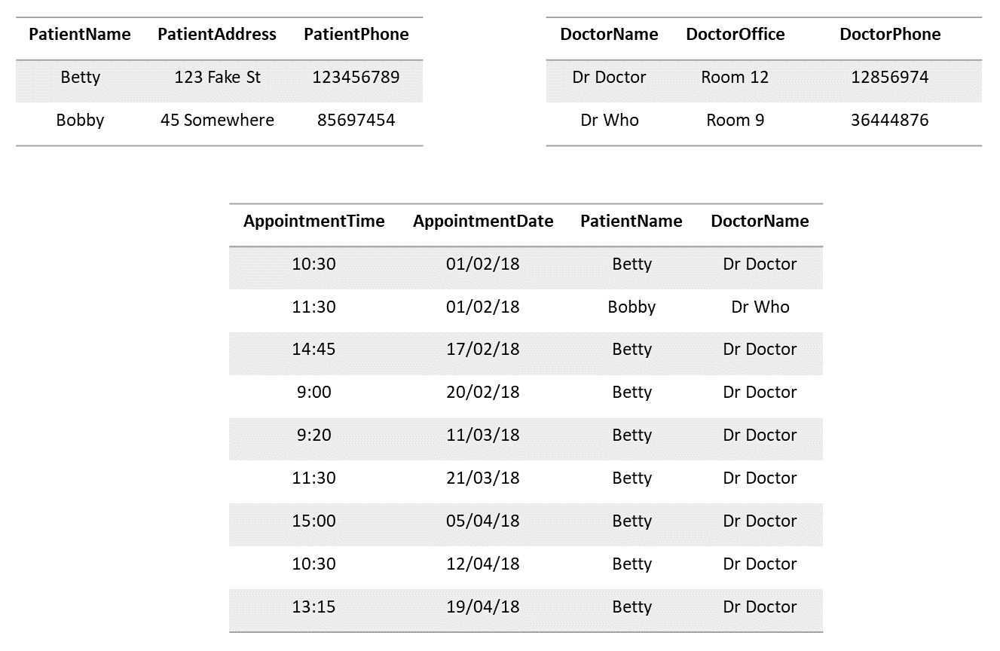
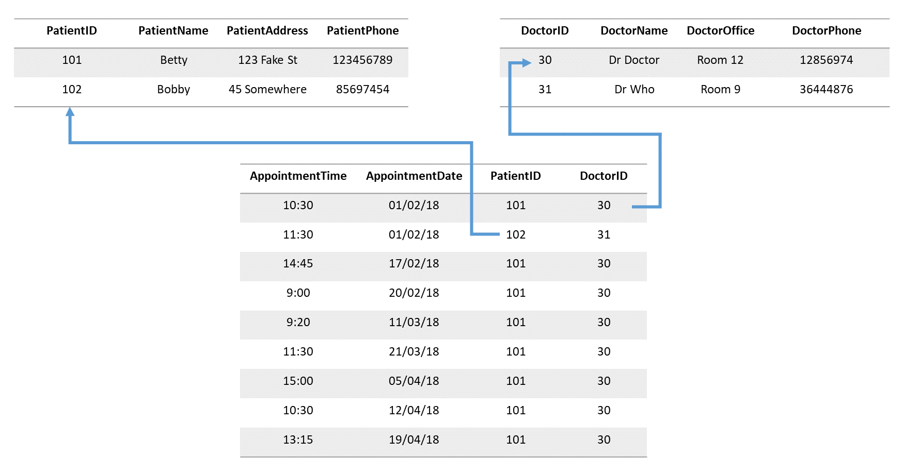

## Relational Databases

Lets start with a simple example, say, keeping a record of appointments for a medical clinic.  
You want to record when and where the appointments were, details about patients, their name, 
address, phone number, etc., and details about the doctors being seen.

You could start keeping a table like this: 

What are your first thoughts about the problems with such a design?  
  
For one thing, when we start getting repeat appointments...  
  

  
...we start gathering a lot of redundant repeated data (imagine if we were recording even more 
information about doctors and patients!). Over time, this would mean a much larger table than
is necessary and a lot of wasted storage space.  
  
Another problem is that if a patient needs to update a detail, say new address, you'd have to find
and replace every copy. Or what if we needed to add a new column of patient information?

This solution is not really scalable or maintainable.
  
So, we could use a design more like this:
  

  
Having separate tables for doctors and patients allows us to have a single record for
any individual, which can be updated as required. A source of truth and no more redundancy.
It's a much neater design. However, what happens if we want to ask questions like "What's the
phone number of everyone that has an appointment with Dr Doctor on the 13th?"
Answering such a question now involves looking up information from multiple tables.
  
Ideally we'd need a system that understood the relationships between the tables and could quickly
and easily put information together and answer any questions ('queries') like that example.
This is what a Relational Database system provides. 
  
An improved Relational Database design for these tables could be:
  

  
Each 'record' is given a unique identifier or 'key'. Integers are commonly used; they are small
to store, easy to assure uniqueness of, and efficient to index and retrieve.  Note that a 
person's name is rarely a reliable unique identifier in a real world application!  
In our appointments table, patients and doctors are referred to simply through their unique 
identifier. Such a field is called a 'foreign key', i.e. a key value that belongs to another
table. Database systems are designed to be able to efficiently make use of table relationships
defined through foreign keys, to lookup associated records through multiple tables as required.
  
This final table design may be represented with an Entity Relationship Diagram:
  

  
In this diagram, a line between boxes represents a relationship between tables. More specifically,
the branching/forking of the line at one end, but not the other, defines the relationship as 
being 'one-to-many'. E.g. A patient may appear in many appointments, but an appointment has only
one patient.
  

## SQL
  
There are many relational database systems implemented, following similar design principles to 
efficiently store and query large volumes of data. Such database systems are quietly behind the
scenes of many websites you may interact with, e.g. Facebook, especially if the website provides
any searchable or sortable data.
  
Some of the most popular database systems include MySQL, Oracle and PostgreSQL. These systems
(and others) have settled on a common (mostly consistent) language and syntax for interacting 
with them, for defining tables and relationships, for inserting/altering data and for making 
queries. This language is called SQL - Structured Query Language.
  
SQL is what we'll be learning through this tutorial. 
  
To introduce SQL, we'll be making use of a lightweight, portable SQL database system, 'SQLite'.
